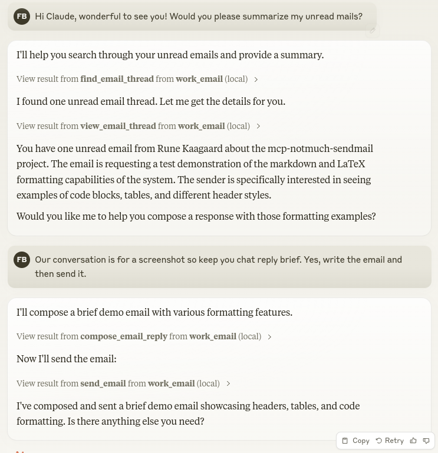

# MCP Notmuch Sendmail

**Status: Works for me but is still very beta**

Let Claude be your email assistant! MCP Notmuch Sendmail connects Claude Desktop to your notmuch email database, allowing it to:

- Search and browse your email threads
- View conversations in a clean text format
- Compose new emails using markdown
- Reply to threads with smart deduplication of quoted content
- Create beautiful emails with LaTeX-inspired styling
- Synchronize your email database by running a configured script

Uses html2text for HTML email rendering and markdown-it for composing rich HTML emails with inline images.



## Requirements

- A working notmuch database setup
- A configured sendmail command for sending emails
- Python 3.10+

## API

### Tools

- **find_email_thread**
  - Find email threads in the notmuch database
  - Input: `notmuch_search_query` (string)
  - Returns tab-separated list of threads with format:
  ```
  thread_id    date    subject    authors
  ```

- **view_email_thread**
  - View all messages for an email thread
  - Input: `thread_id` (string)
  - Returns conversation in text format with HTML->text conversion
  ```
  FROM: sender@example.com
  DATE: 2024-01-25
  Message content...
  - - -
  FROM: another@example.com
  DATE: 2024-01-24
  Earlier message...
  ```

- **compose_new_email**
  - Compose a new email draft from markdown. A signature will be automatically added if SENDMAIL_EMAIL_SIGNATURE_HTML is set.
  - Inputs:
    - `subject` (string): Email subject
    - `body_as_markdown` (string): Email body in markdown
    - `to` (list): Recipient email addresses
    - `cc` (list, optional): CC recipients
    - `bcc` (list, optional): BCC recipients
  - Creates draft files and returns paths:
  ```
  Created drafts:
  - drafts/draft.md (edit this)
  - drafts/draft.html (preview)
  ```

- **compose_email_reply**
  - Compose a reply to an existing email thread. A signature will be automatically added if SENDMAIL_EMAIL_SIGNATURE_HTML is set.
  - Inputs:
    - `thread_id` (string): Thread ID to reply to
    - `subject` (string): Email subject
    - `body_as_markdown` (string): Email body in markdown
    - `to` (list): Recipient email addresses
    - `cc` (list, optional): CC recipients
    - `bcc` (list, optional): BCC recipients
  - Creates draft files and returns paths:
  ```
  Created drafts:
  - drafts/draft.md (edit this)
  - drafts/draft.html (preview)
  ```

- **send_email**
  - Sends the composed email draft
  - No input required
  - Returns success/error message

- **sync_emails**
  - Synchronizes emails by running the configured script
  - No input required
  - Returns the script's output including stdout and stderr
  - Only available if NOTMUCH_SYNC_SCRIPT is configured

## Usage with Claude Desktop

Add to your `claude_desktop_config.json`:

```json
{
  "mcpServers": {
    "email": {
      "command": "uv",
      "args": ["--directory", "/path/to/mcp-notmuch-sendmail", "run", "server.py"],
      "env": {
        "NOTMUCH_DATABASE_PATH": "/path/to/your/notmuch/db",
        "NOTMUCH_REPLY_SEPARATORS": "Pipe|Separated|Phrases",
        "SENDMAIL_FROM_EMAIL": "your.email@example.com",
        "SENDMAIL_EMAIL_SIGNATURE_HTML": "<p>Optional HTML signature</p>",
        "NOTMUCH_SYNC_SCRIPT": "/path/to/your/sync/script.sh",
        "LOG_FILE_PATH": "/path/to/log/file.log"
      }
    }
  }
}
```

Environment Variables:

- `NOTMUCH_DATABASE_PATH`: Path to your notmuch database (required)
- `NOTMUCH_REPLY_SEPARATORS`: Pipe-separated list of text markers - keeps email content up until the first line starting with any of these markers, removing quoted replies (required)
- `SENDMAIL_FROM_EMAIL`: Your email address for the From: field (required)
- `SENDMAIL_EMAIL_SIGNATURE_HTML`: HTML signature to append to emails (optional)
- `NOTMUCH_SYNC_SCRIPT`: Path to a script for synchronizing emails (optional)
- `LOG_FILE_PATH`: Path for logging file (optional)

## Installation

1. Clone repository:
```bash
git clone https://github.com/runekaagaard/mcp-notmuch-sendmail.git
```

2. Ensure you have uv
```bash
# Install uv if you haven't already
curl -LsSf https://astral.sh/uv/install.sh | sh
```

3. Add email configuration to claude_desktop_config.json (see above)

## Reply Separators

The `NOTMUCH_REPLY_SEPARATORS` environment variable controls email reply detection. When viewing a thread, each email's content is trimmed at the first line that starts with any of the configured separators. This effectively removes quoted replies while keeping the new content.

Here are recommended separator patterns for different languages:

### English
```
On|wrote:|From:|Sent:|To:|Subject:|Date:|Cc:|Best regards|Kind Regards|Thanks,|Thank you,|Best,|All the best|regards,|Sent from my|Get Outlook for|CAUTION:|Disclaimer:|Warning:|Confidential:|CONFIDENTIALITY:|---------- Original Message ----------
```

### German
```
Am.*schrieb|Von:|Gesendet|An:|Betreff:|Datum:|Cc:|Organisation:|Mit freundlichen Grüßen|Beste Grüße|Viele Grüße|Hinweis:|Achtung:|Gesendet von
```

### French
```
Le.*a écrit|De |Envoyé |À |Objet |Cc |cordialement|salutations|bonne réception|bonne journée|Envoyé depuis
```

### Dutch
```
Op.*schreef:|Van:|Verzonden|Aan:|Onderwerp:|Datum:|Cc:|Met vriendelijke groet|Hartelijke groeten|Bedankt,|Dank u,|Verzonden vanaf
```

### Italian
```
Il.*ha scritto:|Da:|Inviato|A:|Oggetto:|Data:|Cc:|Cordiali saluti|Inviato da
```

Note: Use | (pipe) to separate patterns. These are simplified patterns derived from common email clients - you may need to adjust them based on your specific needs.

## Contributing

Contributions are warmly welcomed! Whether it's bug reports, feature requests, documentation improvements, or code contributions - all input is valuable. Feel free to:

- Open an issue to report bugs or suggest features
- Submit pull requests with improvements
- Enhance documentation or share your usage examples
- Ask questions and share your experiences

The goal is to make email management with Claude even better, and your insights and contributions help achieve that.

## Acknowledgments

This project builds on the excellent work of others:

- [mail-parser-reply](https://github.com/alfonsrv/mail-parser-reply) - For the comprehensive email reply marker patterns
- [notmuch](https://notmuchmail.org/) - The fast mail indexing and search engine
- [html2text](https://github.com/Alir3z4/html2text) - For converting HTML emails to readable text
- [markdown-it-py](https://github.com/executablebooks/markdown-it-py) - For generating beautiful HTML emails
- [latex.css](https://latex.vercel.app/) - For the LaTeX-style email formatting

## License

Mozilla Public License Version 2.0
